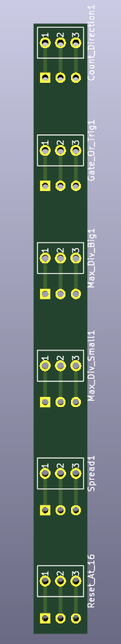

# RCD Switch Expander
PCB and Panel files for a Eurorack switch expander. Designed for the 4MS Rotating Clock Divider (RCD), however it should be useable with any Eurorack module where a SPDT switch can replace a three-pin jumper.

### PCB

PCB is designed using KiCad.

### Panel

The panel was produced via Front Panel Express ([https://www.frontpanelexpress.com/](https://www.frontpanelexpress.com/)). The included Front Design file (FPD) can be used to order the same panel. The panel text was created in Affinity Designer, and imported into Front Design as a graphic object. To change the text, you can either:

A. Replace the graphic object with text engravings:

1. Delete the graphic layer in Front Design.
2. Insert Front Design text engravings.

B. Update the graphic object:

1. Open the included .AI file in a program that can edit Adobe Illustrator files.
2. Edit the text.
3. Hide all non-text layers (they are only there as a reference)
4. Export to PDF
5. Replace the PDF in the 'File' field of the graphic object with your updated object.

### Bill of Materials

| Description                                  | Quantity | Manufacturer Part #  | Notes                                                                                                       |
|----------------------------------------------|----------|----------------------|-------------------------------------------------------------------------------------------------------------|
| Sub Miniature SPDT On-On Switches            | 6        | 108-0042-EVX         | Switch with same specs available from Thonk (DW1):   https://www.thonk.co.uk/shop/sub-mini-toggle-switches/ |
| 1 Row x 3 Pin Male Pin Header (2.54   pitch) | 6        | 68001-403HLF         | Optional, can also solder wires directly to board, or break apart a   longer row of 2.54 mm headers         |
| 2.54 mm Female to Female Jumper Cables       | 12       | Various - Check Ebay | Optinal, if used need 12 for RCD (2 for each switch)                                                        |

 

 

